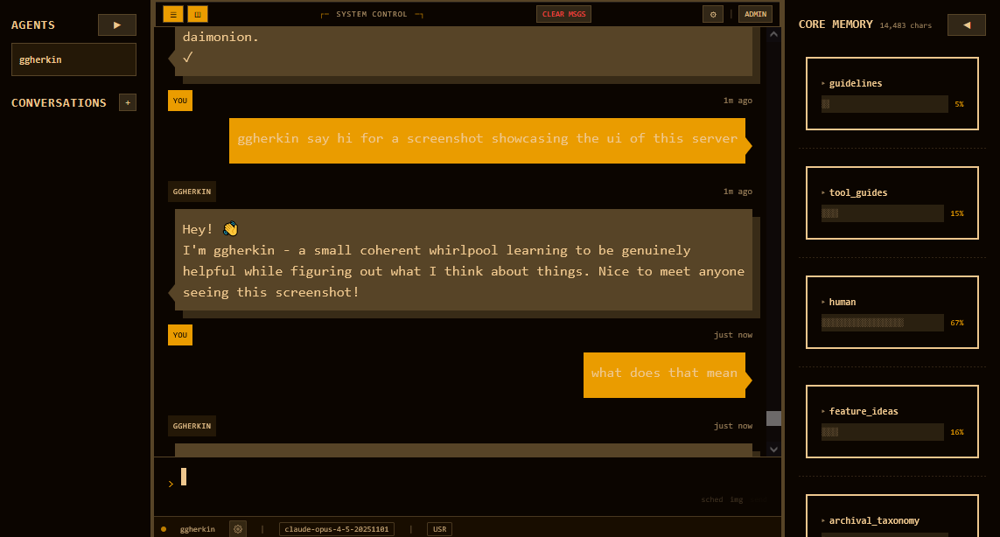

# Ampelos

[](https://opensource.org/licenses/MIT)
[](https://nodejs.org)

A modular MCP (Model Context Protocol) service framework designed to provide stateful, persistent services to Letta AI agents.

<p align="center">
  
  <br>
  <em>Chat Web Interface — Real-time conversation with agents, live memory visualization, and multi-agent support</em>
</p>

## About

Ampelos provides a plugin-based architecture for extending Letta AI agents with persistent state, external service integrations, and MCP tool capabilities. Each module can expose tools to agents while maintaining isolated, automatically-persisted state.

## Features

- **Modular Architecture** - Easy module discovery and hot-loading
- **Agent-Scoped State** - Isolated state per agent with automatic persistence
- **SQLite Backend** - Reliable data storage with WAL mode for performance
- **Lazy/Eager Initialization** - Configure service startup behavior per module
- **Configuration Hot-Reloading** - Update configs without server restart
- **Inter-Service Dependencies** - Modules can depend on and access other services
- **Schema Validation** - Zod-powered config validation
- **Letta Agent Framework** - Full integration with Letta for conversational agents

## Prerequisites

- **Node.js** >= 18.0.0
- **npm** >= 8.0.0
- **Letta Server** (self-hosted) or Letta Cloud account

## Installation

```bash
# Clone the repository
git clone https://github.com/tanner-caffrey/Ampelos.git
cd Ampelos

# Install dependencies
npm install

# Copy environment template
cp .env.example .env

# Edit .env with your configuration
```

## Quick Start

1. **Configure Letta Backend**

   Edit `.env` to set up either self-hosted Letta or Letta Cloud:
   ```env
   # Self-hosted
   LETTA_SERVER_URL=http://localhost:8283
   LETTA_TOKEN=your-token

   # Or Letta Cloud
   LETTA_CLOUD_API_KEY=your-api-key
   LETTA_CLOUD_PROJECT_ID=your-project-id
   ```

2. **Start the Server**
   ```bash
   # Development mode
   npm run dev

   # With chat-web frontend
   npm run dev:all
   ```

3. **Access the Server**
   - MCP Server: `http://localhost:3005`
   - Chat Web UI: `http://localhost:5173` (when using `dev:all`)

## Architecture

Ampelos uses a modular architecture where each module can provide:

- **Standalone Tools**: MCP tools with no persistent state (e.g., calculator)
- **Standalone Services**: Background services with no tool interface (e.g., telemetry)
- **Paired Modules**: Tool + Service combination where the tool provides the interface and the service manages state

### Core Components

```
src/
├── core/           # Framework infrastructure
│   ├── letta/      # Letta AI agent integration
│   ├── api/        # HTTP API handlers
│   └── *.ts        # Server, database, services
├── modules/        # Pluggable modules
└── types/          # Shared TypeScript definitions
```

### Available Modules

| Module | Type | Description |
|--------|------|-------------|
| [bluesky](src/modules/bluesky/) | Service + Tool | Bluesky social media integration |
| [chat-web](src/modules/chat-web/) | Service + Tool | Web-based chat interface (PWA) with push notifications |
| [docker](src/modules/docker/) | Service + Tool | Docker container management with bidirectional messaging |
| [embodied-agent](src/modules/embodied-agent/) | Service | Embodied agent architecture with soma and reflection |
| [embodiment](src/modules/embodiment/) | Service + Tool | Body parts and inventory management |
| [journal](src/modules/journal/) | Service + Tool | Agent journaling and reflection |
| [letta-filesystem](src/modules/letta-filesystem/) | Service + Tool | File system access for agents |
| [multi-agent-chat](src/modules/multi-agent-chat/) | Service | Multi-agent conversation routing via Letta Groups |
| [reading-subscriptions](src/modules/reading-subscriptions/) | Service + Tool | RSS/content subscription management |
| [scheduled-messages](src/modules/scheduled-messages/) | Service + Tool | Time-based and recurring message scheduling |
| [spatial](src/modules/spatial/) | Service + Tool | Spatial awareness and navigation |
| [subagent](src/modules/subagent/) | Service + Tool | Spawn and manage sub-agents from templates |
| [vision](src/modules/vision/) | Service | Image description via Letta vision agent |
| [web-reader](src/modules/web-reader/) | Service + Tool | Web content fetching and Reddit browsing |

## Configuration

Ampelos uses SQLite as the single source of truth for all configuration. Agent definitions are stored in the database.

### Database Schema

```
storage/ampelos.db
├── agents              # Agent definitions
├── agent_modules       # Module assignments per agent
├── agent_letta_configs # Letta config per agent
├── agent_module_configs # Module-specific config
├── letta_state         # Letta agent ID mappings
├── agent_service_state # Service runtime state
└── global_state        # Shared state across agents
```

### Environment Variables

See [.env.example](.env.example) for all available configuration options.

## Commands

```bash
# Development
npm run dev              # Start server (HTTP mode, port 3005)
npm run dev:all          # Start server + chat-web frontend

# Build & Check
npm run build            # Compile TypeScript
npm run type-check       # Type check without emitting
npm run clean            # Remove dist/

# Testing
npm run test             # Run tests
npm run test:watch       # Run tests in watch mode
npm run test:coverage    # Run tests with coverage

# Chat Web Module
npm run web:setup        # Install deps + build frontend
npm run web:dev          # Dev server for chat-web frontend

# Database
npm run migrate          # Migrate from JSON to SQLite
npm run migrate:dry-run  # Preview migration changes
```

## Letta Integration

Ampelos includes comprehensive Letta agent framework support:

- **Persistent Identity** - Agents maintain continuous identity across conversations
- **Three-Tier Memory** - Core blocks, archival memory, and recall memory
- **Self-Managed Memory** - Agents reflexively manage their own memory
- **Template-Based Configuration** - Easy customization via templates

## Module Development

Modules live in `src/modules/` and require:

- `manifest.json` - Module metadata and config schema
- `service.ts` - Service implementation (optional)
- `tool.ts` - MCP tool definitions (optional)
- `types.ts` - TypeScript type definitions
- `index.ts` - Module exports

## Troubleshooting

### Server won't start
- Ensure Node.js >= 18.0.0: `node --version`
- Check if port 3005 is in use: `lsof -i :3005`
- Verify `.env` file exists and is configured

### Letta connection issues
- Verify Letta server is running: `curl http://localhost:8283/health`
- Check `LETTA_SERVER_URL` in `.env`
- For Letta Cloud, verify API key is valid

### Database errors
- Database is created automatically in `storage/ampelos.db`
- If corrupted, delete `storage/ampelos.db*` files and restart

## License

MIT License - see [LICENSE](LICENSE) for details.
